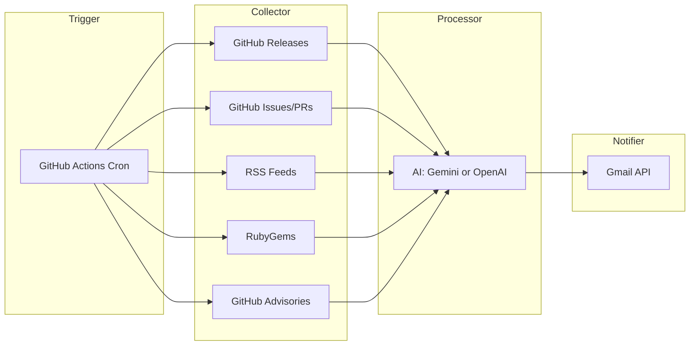

# Web Tech Feeder

AI-powered weekly digest of Frontend, Backend, and DevOps tech news, delivered by email.

## Architecture



## How It Works

1. **Trigger**: GitHub Actions runs every Monday 08:00 (UTC+8)
2. **Collect**: Ruby collectors fetch from GitHub Releases, Issues/PRs, RSS, RubyGems, GitHub Advisories
3. **Process**: AI summarizes and categorizes into frontend/backend/devops with structured blocks (📌 Core point / 🔍 Technical details / 📊 Recommended actions, 2–4 sentences each)
4. **Notify**: HTML email via Gmail API (OAuth 2.0 refresh token); supports dry-run preview to `tmp/digest_preview.html`

## Data Sources

### Frontend
- **Releases**: Node.js, TypeScript, React, Next.js (GitHub API, latest version per repo)
- **Issues/PRs**: Community discussions from above repos
- **RSS**: Node.js Blog, Node.js Security Advisories, JavaScript Weekly, Node Weekly
- **Security**: npm advisories (node, react, next, typescript)

### Backend
- **Releases**: Go, Ruby, Rails, pg, Puma, redis-rb, Faraday, Sidekiq, ruby-jwt, Doorkeeper, Devise
- **Issues/PRs**: Community discussions from above repos
- **RubyGems**: pg, puma, redis, faraday, sidekiq, jwt, doorkeeper, devise
- **RSS**: The Go Blog, Ruby Official News, Rails Security Announcements, Ruby Redmine, Rails Blog, Ruby Weekly
- **Security**: RubyGems advisories

### DevOps
- **Releases**: PostgreSQL (server), Redis (server), Helm, Grafana, ArgoCD, Docker Engine, Reloader, Docker Ruby, Nginx, GitLab, Kubernetes, Terraform, OpenTofu, Amazon EKS AMI
- **Issues/PRs**: Community discussions from above repos
- **RSS**: Amazon EKS Kubernetes Versions (doc updates), GitLab Blog, Kubernetes CVE Feed, HashiCorp Security Bulletins, AWS News, AWS Security, Kubernetes Blog
- **Security**: Go ecosystem advisories (containerd, runc, Kubernetes, Terraform, Docker CLI)

## Prerequisites

- Ruby 3.4.8
- **AI**: [Gemini API Key](https://aistudio.google.com/apikey) (default) **or** OpenAI-compatible API (OpenRouter, Groq, Ollama, OpenAI)
- **Email**: Gmail with OAuth 2.0 (Client ID, Client Secret, Refresh Token)
- (Optional) [GitHub Token](https://github.com/settings/tokens) for higher API rate limits

## Setup

### 1. Install

```bash
git clone https://github.com/william-eth/web_tech_feeder.git
cd web_tech_feeder
bundle install
```

### 2. Configure

```bash
cp .env.example .env
```

Edit `.env`. For **Gemini** (default):

```dotenv
AI_PROVIDER=gemini
GEMINI_API_KEY=AIzaSyxxxxx
```

For **OpenAI / OpenRouter / Groq**:

```dotenv
AI_PROVIDER=openai
AI_API_URL=https://openrouter.ai/api/v1
AI_API_KEY=sk-xxxxx
AI_MODEL=gpt-4o-mini
```

Gmail OAuth (required for sending). Uses refresh token instead of password:

```dotenv
GMAIL_CLIENT_ID=xxxx.apps.googleusercontent.com
GMAIL_CLIENT_SECRET=xxxx
GMAIL_REFRESH_TOKEN=xxxx
EMAIL_FROM=your_email@gmail.com
EMAIL_TO=recipient@example.com
# Multiple: EMAIL_TO=user1@example.com, user2@example.com
# BCC (optional): EMAIL_BCC=archive@example.com, backup@example.com
```

To obtain the refresh token: create OAuth 2.0 credentials in [Google Cloud Console](https://console.cloud.google.com/apis/credentials), then use [OAuth 2.0 Playground](https://developers.google.com/oauthplayground/) with scope `https://www.googleapis.com/auth/gmail.send`.

### 3. Run

```bash
# Preview (no email, saves to tmp/digest_preview.html)
DRY_RUN=true bundle exec ruby bin/generate_digest

# Send email
bundle exec ruby bin/generate_digest
```

### 4. GitHub Actions

Add secrets in `Settings > Secrets and variables > Actions`:

**Required:** `GMAIL_CLIENT_ID`, `GMAIL_CLIENT_SECRET`, `GMAIL_REFRESH_TOKEN`, `EMAIL_FROM`, `EMAIL_TO` (comma/semicolon separated for multiple)  
**Optional:** `EMAIL_BCC` (comma/semicolon separated for BCC recipients)  
**AI (choose one):** Gemini: `GEMINI_API_KEY` ｜ OpenAI: `AI_PROVIDER`, `AI_API_URL`, `AI_API_KEY`, `AI_MODEL`  
**Optional:** `GH_PAT_TOKEN` (higher GitHub API rate limits; do not create `GITHUB_TOKEN`, that name is reserved)

Runs every Monday 08:00 (UTC+8); can be triggered manually from the **Actions** tab.

## Documentation

Use docs by intent:
- User setup and operations: this `README.md`
- Developer workflow and code change entrypoints: `docs/CONTRIBUTING.md`
- Architecture decisions and trade-offs: `docs/PLAN.md`

## Project Structure

High-level runtime layout:

```
web_tech_feeder/
├── lib/
│   ├── web_tech_feeder.rb        # Thin entrypoint
│   ├── services/                 # Pipeline, collection orchestration, digest filtering
│   ├── collectors/               # Source collection from GitHub/RSS/RubyGems/Advisories
│   ├── enrichers/                # RSS-linked issue/PR enrichment
│   ├── github/                   # Shared GitHub client and compare/reference helpers
│   ├── processor/                # AI processing (Gemini/OpenAI-compatible)
│   ├── notifier/                 # Digest delivery
│   ├── templates/                # HTML digest template
│   └── utils/                    # Shared utility modules
├── docs/                         # Contributor and design docs
├── bin/generate_digest
└── .env.example
```

For file-level mapping and change entrypoints, see `docs/CONTRIBUTING.md`.

## Configuration

| Variable | Default | Description |
|----------|---------|-------------|
| `AI_PROVIDER` | `gemini` | `gemini` or `openai` |
| `DRY_RUN` | `false` | `true` = preview only, no email |
| `DEEP_PR_CRAWL` | `true` | `false` = skip PR compare + linked PR deep crawling to speed up test runs |
| `COLLECT_PARALLEL` | `true` | Enable parallel source/repo collection (`false` for strict sequential mode) |
| `MAX_COLLECT_THREADS` | `4`/`2` | Source-level worker threads (`4` with token, `2` without token) |
| `MAX_REPO_THREADS` | `3`/`2` | Repo-level worker threads inside GitHub collectors (`3` with token, `2` without token) |
| `VERBOSE_CID_LOGS` | `false` | Show `[cid=...]` on verbose collector/client/cache logs (run-level banners still include CID) |
| `VERBOSE_THREAD_LOGS` | `false` | Show `[tid=...]` on verbose collector/client/cache logs for parallel debugging |
| `LOOKBACK_DAYS` | `7` | Full-day window in TPE (UTC+8): from N days ago `00:00` to `now` |
| `RUBY_YJIT_ENABLE` | unset | Set `1` to enable YJIT (Ruby 3.1+) |
| `DIGEST_MIN_IMPORTANCE` | `high` | `high`, `medium`, or `low` |
| `AI_MAX_TOKENS` | `16384` | Max completion/output tokens |
| `AI_USE_MAX_COMPLETION_TOKENS` | auto | Set `true` if model rejects `max_tokens` (e.g. GPT-5.x, o1); auto-detected for `gpt-5*`, `o1-*`, `o3-*` |

AI processing reliability:
- Retries up to 3 times per category on any processing error (API/network/empty response/invalid JSON)
- Category-to-category wait is 5 seconds (`frontend` -> `backend` -> `devops`)

GitHub collection reliability:
- GitHub API 403/429 rate-limit responses use exponential backoff retry
- Secondary rate limit (403) is treated as retryable when response message indicates rate limiting
- Collected items are normalized with stable sort to keep output order deterministic

Runtime note:
- When `RUBY_YJIT_ENABLE=1` is set in `.env`, `bin/generate_digest` re-execs itself with `--yjit` so YJIT takes effect even though Dotenv loads after process start.

### Sources

Edit `lib/sources.yml`:

- **github_releases**: `owner`, `repo`, `name` (optional: `release_strategy`, `release_notes_files`)
  - `release_strategy`: `auto` (default), `releases_only`, `tags_only`
  - `release_notes_files`: optional list of changelog-like files (e.g. `Changes.md`, `CHANGELOG.md`) used to enrich sparse release/tag notes
- **github_issues**: `owner`, `repo`, `name`
- **rss_feeds**: `url`, `name`
- **rubygems**: gem names
- **github_advisories**: `ecosystem`, `packages`

## License

MIT License. See [LICENSE](LICENSE).
