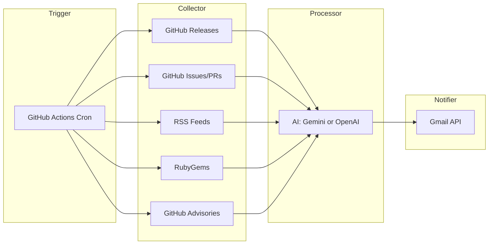

# Web Tech Feeder

AI-powered weekly digest of Frontend, Backend, and DevOps tech news, delivered by email.

## Architecture



## How It Works

1. **Trigger**: GitHub Actions runs every Monday 08:00 (UTC+8)
2. **Collect**: Ruby collectors fetch from GitHub Releases, Issues/PRs, RSS, RubyGems, GitHub Advisories
3. **Process**: AI summarizes and categorizes into frontend/backend/devops with structured blocks (📌 Core point / 🔍 Technical details / 📊 Recommended actions, 2–4 sentences each)
4. **Notify**: HTML email via Gmail API (OAuth 2.0 refresh token); supports dry-run preview to `tmp/digest_preview.html`

## Data Sources

### Frontend
- **Releases**: Node.js, TypeScript, React, Next.js (GitHub API, latest version per repo)
- **Issues/PRs**: Community discussions from above repos
- **RSS**: Node.js Blog, Node.js Security Advisories, JavaScript Weekly, Node Weekly
- **Security**: npm advisories (node, react, next, typescript)

### Backend
- **Releases**: Go, Ruby, Rails, pg, Puma, redis-rb, Faraday, Sidekiq, ruby-jwt, Doorkeeper, Devise
- **Issues/PRs**: Community discussions from above repos
- **RubyGems**: pg, puma, redis, faraday, sidekiq, jwt, doorkeeper, devise
- **RSS**: The Go Blog, Ruby Official News, Rails Security Announcements, Ruby Redmine, Rails Blog, Ruby Weekly
- **Security**: RubyGems advisories

### DevOps
- **Releases**: Redis (server), Helm, Grafana, ArgoCD, Docker Engine, Reloader, Docker Ruby, Nginx, GitLab, Kubernetes, Terraform, OpenTofu, Amazon EKS AMI
- **Issues/PRs**: Community discussions from above repos
- **RSS**: PostgreSQL News & Releases, Amazon EKS Kubernetes Versions (doc updates), GitLab Blog, Kubernetes CVE Feed, HashiCorp Security Bulletins, AWS News, AWS Security, Kubernetes Blog
- **Security**: Go ecosystem advisories (containerd, runc, Kubernetes, Terraform, Docker CLI)

## Prerequisites

- Ruby 3.4.8
- **AI**: [Gemini API Key](https://aistudio.google.com/apikey) (default) **or** OpenAI-compatible API (OpenRouter, Groq, Ollama, OpenAI)
- **Email**: Gmail with OAuth 2.0 (Client ID, Client Secret, Refresh Token)
- (Optional) [GitHub Token](https://github.com/settings/tokens) for higher API rate limits

## Setup

### 1. Install

```bash
git clone https://github.com/william-eth/web_tech_feeder.git
cd web_tech_feeder
bundle install
```

### 2. Configure

```bash
cp .env.example .env
```

Edit `.env`. For **Gemini** (default):

```dotenv
AI_PROVIDER=gemini
GEMINI_API_KEY=AIzaSyxxxxx
```

For **OpenAI / OpenRouter / Groq**:

```dotenv
AI_PROVIDER=openai
AI_API_URL=https://openrouter.ai/api/v1
AI_API_KEY=sk-xxxxx
AI_MODEL=gpt-4o-mini
```

Gmail OAuth (required for sending). Uses refresh token instead of password:

```dotenv
GMAIL_CLIENT_ID=xxxx.apps.googleusercontent.com
GMAIL_CLIENT_SECRET=xxxx
GMAIL_REFRESH_TOKEN=xxxx
EMAIL_FROM=your_email@gmail.com
EMAIL_TO=recipient@example.com
# Multiple: EMAIL_TO=user1@example.com, user2@example.com
# BCC (optional): EMAIL_BCC=archive@example.com, backup@example.com
```

To obtain the refresh token: create OAuth 2.0 credentials in [Google Cloud Console](https://console.cloud.google.com/apis/credentials), then use [OAuth 2.0 Playground](https://developers.google.com/oauthplayground/) with scope `https://www.googleapis.com/auth/gmail.send`.

### 3. Run

```bash
# Preview (no email, saves to tmp/digest_preview.html)
DRY_RUN=true bundle exec ruby bin/generate_digest

# Send email
bundle exec ruby bin/generate_digest
```

### 4. GitHub Actions

Add secrets in `Settings > Secrets and variables > Actions`:

**Required:** `GMAIL_CLIENT_ID`, `GMAIL_CLIENT_SECRET`, `GMAIL_REFRESH_TOKEN`, `EMAIL_FROM`, `EMAIL_TO` (comma/semicolon separated for multiple)  
**Optional:** `EMAIL_BCC` (comma/semicolon separated for BCC recipients)  
**AI (choose one):** Gemini: `GEMINI_API_KEY` ｜ OpenAI: `AI_PROVIDER`, `AI_API_URL`, `AI_API_KEY`, `AI_MODEL`  
**Optional:** `GH_PAT_TOKEN` (higher GitHub API rate limits; do not create `GITHUB_TOKEN`, that name is reserved)

Runs every Monday 08:00 (UTC+8); can be triggered manually from the **Actions** tab.

## Documentation

See [docs/](docs/) for setup guides and contributing guidelines.

## Project Structure

```
web_tech_feeder/
├── .github/workflows/
│   └── weekly_digest.yml
├── .rubocop.yml
├── .ruby-version
├── CHANGELOG.md
├── docs/                     # Documentation
├── lib/
│   ├── web_tech_feeder.rb       # Orchestrator
│   ├── config.rb                # Config loader
│   ├── sources.yml               # Source definitions
│   ├── collectors/
│   │   ├── base_collector.rb
│   │   ├── github_release_collector.rb
│   │   ├── github_issue_collector.rb
│   │   ├── github_advisory_collector.rb
│   │   ├── rss_collector.rb
│   │   └── rubygems_collector.rb
│   ├── processor/
│   │   ├── base_processor.rb     # Shared prompt, parsing
│   │   ├── gemini_processor.rb
│   │   └── openai_processor.rb
│   ├── prompts/
│   │   └── category_digest.erb   # Prompt template
│   ├── notifier/
│   │   └── smtp_notifier.rb
│   └── templates/
│       └── digest.html.erb
├── bin/generate_digest
├── Gemfile
└── .env.example
```

## Configuration

| Variable | Default | Description |
|----------|---------|-------------|
| `AI_PROVIDER` | `gemini` | `gemini` or `openai` |
| `DRY_RUN` | `false` | `true` = preview only, no email |
| `LOOKBACK_DAYS` | `7` | Days to look back |
| `DIGEST_MIN_IMPORTANCE` | `high` | `high`, `medium`, or `low` |
| `AI_MAX_TOKENS` | `16384` | For reasoning models |

### Sources

Edit `lib/sources.yml`:

- **github_releases**: `owner`, `repo`, `name` — one latest release per repo
- **github_issues**: `owner`, `repo`, `name`
- **rss_feeds**: `url`, `name`
- **rubygems**: gem names
- **github_advisories**: `ecosystem`, `packages`

## License

MIT License. See [LICENSE](LICENSE).
